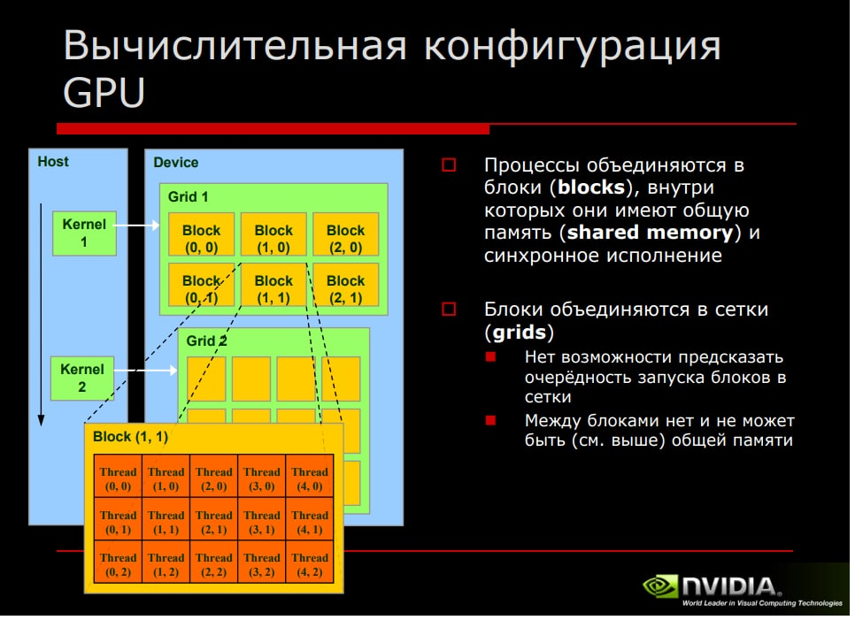

## Resourses

1. [статья на хабре](https://habr.com/ru/post/54707/)
2. [туториал по CUDA](https://edu.mmcs.sfedu.ru/mod/resource/view.php?id=12448&forceview=1)
3. [NVIDIA](https://www.nvidia.ru/docs/IO/60385/Lecture_22.pdf)
4. [OpenCL vs CUDA](https://www.incredibuild.com/blog/cuda-vs-opencl-which-to-use-for-gpu-programming)
5. [слайды](http://hpc-education.ru/files/lectures/2011/gergel/gergel_2011_lecture09.pdf)
6. [Profiler](http://academy2017.hpc-russia.ru/files/cuda-n3.pdf)

## Screens 

 

## Применение CUDA
[VideoTech: Обработка изображений на CUDA для задач с видео](https://vtconf.com/talks/a5563c9c5c0a43bcab257e0f7f1e55dc/)